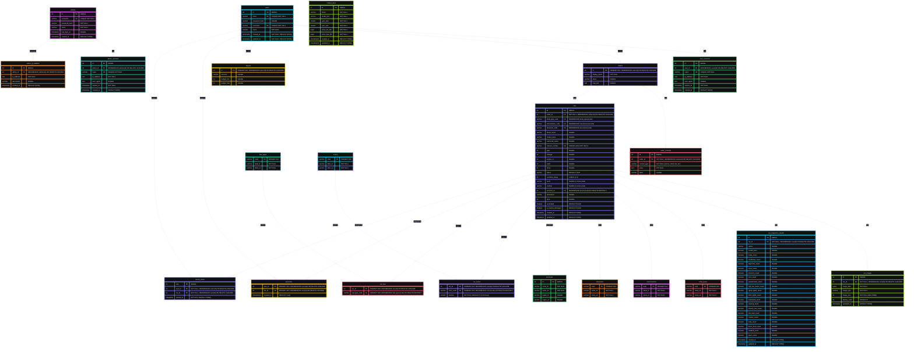

```mermaid
---
config:
  theme: redux-dark-color
---
erDiagram
    direction TB

    %% --- Admin Tables (001) ---
    admins {
        int id PK "SERIAL"
        varchar username UK "UNIQUE NOT NULL"
        varchar password_hash "NOT NULL"
        varchar name "NOT NULL"
        timestamp last_login_at "Nullable"
        timestamp created_at "DEFAULT NOW()"
    }

    admin_sessions {
        int id PK "SERIAL"
        int admin_id FK "REFERENCES admins(id) ON DELETE CASCADE"
        varchar token UK "UNIQUE NOT NULL"
        inet ip_address "NOT NULL"
        text user_agent "Nullable"
        timestamp expires_at "NOT NULL"
        timestamp created_at "DEFAULT NOW()"
    }

    admin_ip_whitelist {
        int id PK "SERIAL"
        int admin_id FK "REFERENCES admins(id) ON DELETE CASCADE"
        inet ip_address "NOT NULL"
        varchar description "Nullable"
        timestamp created_at "DEFAULT NOW()"
    }

    %% --- User Tables (002, 004, 006) ---
    users {
        int id PK "SERIAL"
        varchar email UK "UNIQUE NOT NULL"
        varchar password_hash "Nullable"
        varchar username UK "UNIQUE NOT NULL"
        varchar name "NOT NULL"
        timestamp created_at "NOT NULL DEFAULT NOW()"
        timestamp updated_at "NOT NULL DEFAULT NOW()"
    }

    user_sessions {
        int id PK "SERIAL"
        int user_id FK "REFERENCES users(id) ON DELETE CASCADE"
        varchar token UK "UNIQUE NOT NULL"
        inet ip_address "NOT NULL"
        text user_agent "Nullable"
        timestamp expires_at "NOT NULL"
        timestamp created_at "DEFAULT NOW()"
    }

    sellers {
        int id PK "PRIMARY KEY, REFERENCES users(id) ON DELETE CASCADE"
        varchar display_name "NOT NULL"
        varchar about "Nullable"
        text map_link "Nullable"
    }

    seller_contacts {
        int id PK "SERIAL"
        int seller_id FK "NOT NULL, REFERENCES sellers(id) ON DELETE CASCADE"
        varchar contact_type "NOT NULL (phone, email, line, etc)"
        text value "NOT NULL"
        varchar label "Nullable"
    }

    buyers {
        int id PK "PRIMARY KEY, REFERENCES users(id) ON DELETE CASCADE"
        varchar province "Nullable"
        int budget_min "Nullable"
        int budget_max "Nullable"
    }

    %% --- Car Tables (005) ---
    cars {
        int id PK "SERIAL"
        int seller_id FK "NOT NULL, REFERENCES sellers(id) ON DELETE CASCADE"
        varchar body_type_code FK "REFERENCES body_types(code)"
        varchar transmission_code FK "REFERENCES transmissions(code)"
        varchar drivetrain_code FK "REFERENCES drivetrains(code)"
        varchar brand_name "Nullable"
        varchar model_name "Nullable"
        varchar submodel_name "Nullable"
        varchar chassis_number UK "UNIQUE (when NOT NULL)"
        int year "Nullable"
        int mileage "Nullable"
        int engine_cc "Nullable"
        int seats "Nullable"
        int doors "Nullable"
        varchar status "DEFAULT 'draft'"
        int condition_rating "CHECK (1-5)"
        varchar prefix "Nullable (License plate)"
        varchar number "Nullable (License plate)"
        int province_id FK "REFERENCES provinces(id) ON DELETE RESTRICT"
        varchar description "Nullable"
        int price "Nullable"
        boolean is_flooded "DEFAULT FALSE"
        boolean is_heavily_damaged "DEFAULT FALSE"
        timestamp created_at "DEFAULT NOW()"
        timestamp updated_at "DEFAULT NOW()"
    }

    car_images {
        int id PK "SERIAL"
        int car_id FK "NOT NULL, REFERENCES cars(id) ON DELETE CASCADE"
        bytea image_data "NOT NULL"
        varchar image_type "NOT NULL"
        int image_size "NOT NULL (Max 50MB)"
        int display_order "DEFAULT 0"
        timestamp uploaded_at "DEFAULT NOW()"
    }

    car_inspection_results {
        int id PK "SERIAL"
        int car_id FK "NOT NULL, REFERENCES cars(id) ON DELETE CASCADE"
        varchar station "Nullable"
        boolean overall_pass "Nullable"
        boolean brake_result "Nullable"
        boolean handbrake_result "Nullable"
        boolean alignment_result "Nullable"
        boolean noise_result "Nullable"
        boolean emission_result "Nullable"
        boolean horn_result "Nullable"
        boolean speedometer_result "Nullable"
        boolean high_low_beam_result "Nullable"
        boolean signal_lights_result "Nullable"
        boolean other_lights_result "Nullable"
        boolean windshield_result "Nullable"
        boolean steering_result "Nullable"
        boolean wheels_tires_result "Nullable"
        boolean fuel_tank_result "Nullable"
        boolean chassis_result "Nullable"
        boolean body_result "Nullable"
        boolean doors_floor_result "Nullable"
        boolean seatbelt_result "Nullable"
        boolean wiper_result "Nullable"
        timestamp created_at "DEFAULT NOW()"
        timestamp updated_at "DEFAULT NOW()"
    }

    %% --- Reference Tables (003) ---
    body_types {
        varchar code PK "PRIMARY KEY"
        varchar name_th "NOT NULL"
        varchar name_en "NOT NULL"
    }

    transmissions {
        varchar code PK "PRIMARY KEY"
        varchar name_th "NOT NULL"
        varchar name_en "NOT NULL"
    }

    fuel_types {
        varchar code PK "PRIMARY KEY"
        varchar label_th "NOT NULL"
        varchar label_en "NOT NULL"
    }

    drivetrains {
        varchar code PK "PRIMARY KEY"
        varchar name_th "NOT NULL"
        varchar name_en "NOT NULL"
    }

    colors {
        varchar code PK "PRIMARY KEY"
        varchar label_th "NOT NULL"
        varchar label_en "NOT NULL"
    }

    provinces {
        int id PK "SERIAL"
        varchar name_th "NOT NULL"
        varchar name_en "NOT NULL"
        varchar region_th "Nullable"
        varchar region_en "Nullable"
    }

    %% --- Junction Tables (Many-to-Many) ---
    car_colors {
        int car_id PK "PRIMARY KEY, REFERENCES cars(id) ON DELETE CASCADE"
        varchar color_code PK "PRIMARY KEY, REFERENCES colors(code) ON DELETE RESTRICT"
        smallint position "NOT NULL DEFAULT 0 (0=primary)"
    }

    car_fuel {
        int car_id PK "PRIMARY KEY, REFERENCES cars(id) ON DELETE CASCADE"
        varchar fuel_type_code PK "PRIMARY KEY, REFERENCES fuel_types(code) ON DELETE RESTRICT"
    }

    favourites {
        int user_id PK "PRIMARY KEY, REFERENCES users(id) ON DELETE CASCADE"
        int car_id PK "PRIMARY KEY, REFERENCES cars(id) ON DELETE CASCADE"
        timestamptz created_at "DEFAULT now()"
    }

    recent_views {
        int rvid PK "SERIAL"
        int user_id FK "NOT NULL, REFERENCES users(id) ON DELETE CASCADE"
        int car_id FK "NOT NULL, REFERENCES cars(id) ON DELETE CASCADE"
        timestamp viewed_at "NOT NULL DEFAULT NOW()"
    }

    %% --- Market Data Table (007) ---
    market_price {
        int id PK "SERIAL"
        varchar brand "NOT NULL"
        varchar model_trim "NOT NULL"
        smallint year_start "NOT NULL"
        smallint year_end "NOT NULL"
        bigint price_min_thb "NOT NULL"
        bigint price_max_thb "NOT NULL"
        timestamptz created_at "DEFAULT NOW()"
        timestamptz updated_at "DEFAULT NOW()"
    }

    %% --- Relationships ---
    admins ||--o{ admin_sessions : "has"
    admins ||--o{ admin_ip_whitelist : "manages"

    users ||--o{ user_sessions : "has"
    users ||--o| sellers : "is (1:1)"
    users ||--o| buyers : "is (1:1)"

    sellers ||--o{ seller_contacts : "has"
    sellers ||--o{ cars : "sells"

    cars ||--o{ car_images : "has"
    cars ||--o{ car_inspection_results : "has"
    
    %% --- Car Foreign Keys to Reference Tables ---
    cars }o--|| body_types : "uses"
    cars }o--|| transmissions : "uses"
    cars }o--|| drivetrains : "uses"
    cars }o--|| provinces : "located in"

    %% --- Many-to-Many Relationships ---
    cars ||--o{ car_colors : "maps to"
    colors ||--o{ car_colors : "used in"

    cars ||--o{ car_fuel : "maps to"
    fuel_types ||--o{ car_fuel : "used in"

    users ||--o{ favourites : "maps to"
    cars ||--o{ favourites : "mapped by"

    users ||--o{ recent_views : "maps to"
    cars ||--o{ recent_views : "mapped by"
```
