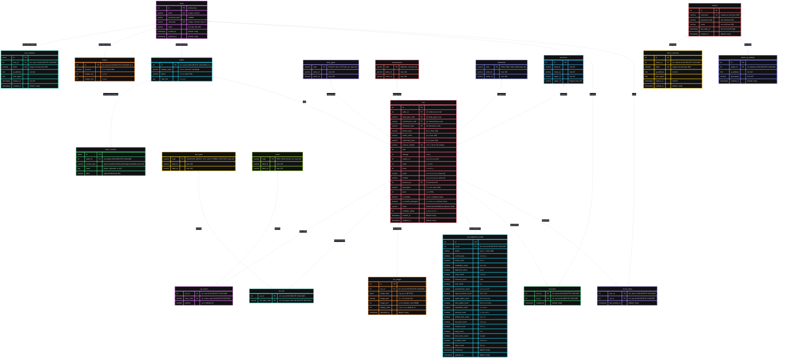

```mermaid
---
config:
  theme: redux-dark-color
---
erDiagram
    direction TB

    users {
        int id PK "primary key"
        varchar email UK "unique, not null"
        varchar password_hash "nullable"
        varchar username UK "unique, not null, max 20"
        varchar name "not null, max 100"
        timestamp created_at "default: now()"
        timestamp updated_at "default: now()"
    }

    user_sessions {
        serial id PK ""
        int user_id FK "ref: users.id ON DELETE CASCADE"
        varchar token UK "unique not null, max 500"
        inet ip_address "not null"
        text user_agent ""
        timestamp expires_at "not null"
        timestamp created_at "default: now()"
    }

    buyers {
        int id PK "ref: users.id ON DELETE CASCADE (1:1)"
        varchar province "จังหวัด (max 100)"
        int budget_min "งบขั้นต่ำ"
        int budget_max "งบสูงสุด"
    }

    sellers {
        int id PK "ref: users.id ON DELETE CASCADE (1:1)"
        varchar display_name "ชื่อแสดง (max 50, not blank)"
        varchar about "เกี่ยวกับ (max 200)"
        text map_link "ลิงก์แผนที่"
    }

    seller_contacts {
        serial id PK ""
        int seller_id FK "ref: sellers.id ON DELETE CASCADE"
        varchar contact_type "phone/email/line/facebook/instagram/website (max 20)"
        text value "phone, @handle, or URL"
        varchar label "optional label (max 80)"
    }

    body_types {
        varchar code PK "PICKUP, SUV, CITYCAR, etc. (max 20)"
        varchar name_th "max 100"
        varchar name_en "max 100"
    }

    transmissions {
        varchar code PK "MANUAL, AT (max 10)"
        varchar name_th "max 100"
        varchar name_en "max 100"
    }

    fuel_types {
        varchar code PK "GASOLINE, DIESEL, LPG, CNG, HYBRID, ELECTRIC (max 20)"
        varchar label_th "max 100"
        varchar label_en "max 100"
    }

    drivetrains {
        varchar code PK "FWD, RWD, AWD, 4WD (max 10)"
        varchar name_th "max 100"
        varchar name_en "max 100"
    }

    colors {
        varchar code PK "RED, GRAY, BLUE, etc. (max 20)"
        varchar label_th "max 100"
        varchar label_en "max 100"
    }

    provinces {
        int id PK ""
        varchar name_th "max 50"
        varchar name_en "max 50"
        varchar region_th "max 30"
        varchar region_en "Region (max 30)"
    }

    cars {
        int id PK ""
        int seller_id FK "ref: sellers.id, not null"
        varchar body_type_code FK "ref: body_types.code"
        varchar transmission_code FK "ref: transmissions.code"
        varchar drivetrain_code FK "ref: drivetrains.code"
        varchar brand_name "ยี่ห้อรถ (max 100)"
        varchar model_name "รุ่นรถ (max 100)"
        varchar submodel_name "รุ่นย่อย (max 100)"
        varchar chassis_number UK "เลขตัวถัง (max 30, unique)"
        int year "ปี"
        int mileage "เลขไมล์"
        int engine_cc "ขนาดเครื่องยนต์ (ซีซี)"
        int seats "จำนวนที่นั่ง"
        int doors "จำนวนประตู"
        varchar prefix "เลขทะเบียนส่วนหน้า (max 10)"
        varchar number "เลขทะเบียนส่วนหลัง (max 10)"
        int province_id FK "ref: provinces.id"
        varchar description "รายละเอียด (max 200)"
        int price "ราคา (THB)"
        boolean is_flooded "เคยน้ำท่วม (default: false)"
        boolean is_heavily_damaged "ความเสียหายหนัก (default: false)"
        varchar status "draft/active/sold/deleted (default: 'draft')"
        int condition_rating "คะแนนสภาพ 1-5"
        timestamp created_at "default: now()"
        timestamp updated_at "default: now()"
    }

    car_colors {
        int car_id PK "ref: cars.id ON DELETE CASCADE"
        varchar color_code PK "ref: colors.code ON DELETE RESTRICT"
        smallint position "ลำดับสี (default: 0)"
    }

    car_fuel {
        int car_id PK "ref: cars.id ON DELETE CASCADE"
        varchar fuel_type_code PK "ref: fuel_types.code ON DELETE RESTRICT"
    }

    car_images {
        int id PK ""
        int car_id FK "ref: cars.id ON DELETE CASCADE"
        bytea image_data "ข้อมูลรูปภาพ (BYTEA)"
        varchar image_type "ประเภทไฟล์ (max 50)"
        int image_size "ขนาดไฟล์ (bytes, max 50MB)"
        int display_order "ลำดับการแสดง (default: 0)"
        timestamp uploaded_at "default: now()"
    }

    car_inspection_results {
        int id PK ""
        int car_id FK "ref: cars.id ON DELETE CASCADE"
        varchar station "ศูนย์ตรวจ (max 200)"
        boolean overall_pass "ผ่านทั้งหมด"
        boolean brake_result "ผลเบรค"
        boolean handbrake_result "ผลเบรคมือ"
        boolean alignment_result "ศูนย์ล้อ"
        boolean noise_result "ระดับเสียง"
        boolean emission_result "มลพิษ"
        boolean horn_result "แตร"
        boolean speedometer_result "มาตรวัดความเร็ว"
        boolean high_low_beam_result "ไฟพุ่งไกล/ต่ำ"
        boolean signal_lights_result "ไฟเลี้ยว/ป้าย/หยุด"
        boolean other_lights_result "ไฟป้ายทะเบียน/อื่นๆ"
        boolean windshield_result "กระจกกันลม"
        boolean steering_result "ระบบบังคับเลี้ยว"
        boolean wheels_tires_result "ล้อและยาง"
        boolean fuel_tank_result "ถังเชื้อเพลิง"
        boolean chassis_result "เครื่องล่าง"
        boolean body_result "ตัวถัง"
        boolean doors_floor_result "ประตู/พื้น"
        boolean seatbelt_result "เข็มขัดนิรภัย"
        boolean wiper_result "ปัดน้ำฝน"
        timestamp created_at "default: now()"
        timestamp updated_at "default: now()"
    }

    favourites {
        int user_id PK "ref: users.id ON DELETE CASCADE"
        int car_id PK "ref: cars.id ON DELETE CASCADE"
        timestamp created_at "default: now()"
    }

    recent_views {
        int user_id PK "ref: users.id ON DELETE CASCADE"
        int car_id PK "ref: cars.id ON DELETE CASCADE"
        timestamp last_viewed_at "default: now()"
    }

    admins {
        int id PK ""
        varchar username UK "unique not null (max 100)"
        varchar password_hash "not null (max 255)"
        varchar name "not null (max 100)"
        timestamp last_login_at "last successful login"
        timestamp created_at "default: now()"
    }

    admin_sessions {
        int id PK ""
        int admin_id FK "ref: admins.id ON DELETE CASCADE"
        varchar token UK "unique not null (max 500)"
        inet ip_address "not null"
        text user_agent ""
        timestamp expires_at "not null"
        timestamp created_at "default: now()"
    }

    admin_ip_whitelist {
        int id PK ""
        int admin_id FK "ref: admins.id ON DELETE CASCADE"
        inet ip_address "not null"
        varchar description "max 255"
        timestamp created_at "default: now()"
    }

    %% Relationships
    users ||--o{ user_sessions : "has many sessions"
    users ||--o| buyers : "has buyer profile"
    users ||--o| sellers : "has seller profile"

    sellers ||--o{ seller_contacts : "has contact methods"
    sellers ||--o{ cars : "sells"
    
    cars ||--o{ car_colors : "has colors"
    cars ||--o{ car_fuel : "uses fuel types"
    cars ||--o{ car_images : "has images"
    cars ||--o{ car_inspection_results : "has inspections"
    
    body_types ||--o{ cars : "categorizes"
    transmissions ||--o{ cars : "categorizes"
    fuel_types ||--o{ car_fuel : "used by"
    drivetrains ||--o{ cars : "categorizes"
    colors ||--o{ car_colors : "used by"
    provinces ||--o{ cars : "located in"

    users ||--o{ favourites : "favorites"
    cars  ||--o{ favourites : "favorited by"

    users ||--o{ recent_views : "views"
    cars  ||--o{ recent_views : "viewed by"

    admins ||--o{ admin_sessions : "has many"
    admins ||--o{ admin_ip_whitelist : "has many"
```
