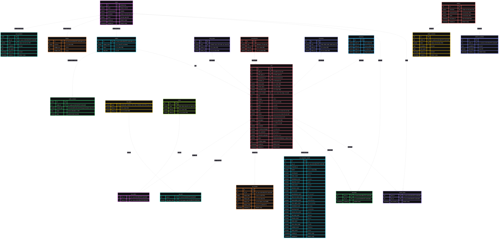

```mermaid
---
config:
  theme: redux-dark-color
---
erDiagram
	direction TB

	users {
		int id PK "primary key"
		varchar email UK "unique, not null"
		varchar password_hash "nullable"
		varchar username UK "unique, not null, max 20"
		varchar name "not null, max 100"
		timestamp created_at "default: now()"
		timestamp updated_at "default: now()"
	}

	user_sessions {
		serial id PK ""
		int user_id FK "ref: users.id ON DELETE CASCADE"
		varchar token UK "unique not null, max 500"
		inet ip_address "not null"
		text user_agent ""
		timestamp expires_at "not null"
		timestamp created_at "default: now()"
	}

	buyers {
		int id PK "ref: users.id ON DELETE CASCADE (1:1)"
		varchar province "จังหวัด (max 100)"
		int budget_min "งบขั้นต่ำ"
		int budget_max "งบสูงสุด"
	}

	sellers {
		int id PK "ref: users.id ON DELETE CASCADE (1:1)"
		varchar display_name "ชื่อแสดง (max 50, not blank)"
		text about "เกี่ยวกับ (max 200)"
		text map_link "ลิงก์แผนที่"
	}

	seller_contacts {
		serial id PK ""
		int seller_id FK "ref: sellers.id ON DELETE CASCADE"
		varchar contact_type "phone/email/line/facebook/instagram/website (max 20)"
		text value "phone, @handle, or URL"
		varchar label "optional label (max 80)"
	}

	body_types {
		int id PK ""
		varchar code UK "PICKUP, SUV, CITYCAR, etc. (max 20)"
		varchar name_th "ชื่อไทย (max 100)"
		varchar name_en "ชื่ออังกฤษ (max 100)"
	}

	transmissions {
		int id PK ""
		varchar code UK "MANUAL, AT (max 10)"
		varchar name_th "ชื่อไทย (max 100)"
		varchar name_en "ชื่ออังกฤษ (max 100)"
	}

	fuel_types {
		varchar code PK "GASOLINE, DIESEL, LPG, CNG, HYBRID, ELECTRIC (max 20)"
		varchar label_th "ชื่อไทย (max 100)"
		varchar label_en "ชื่ออังกฤษ (max 100)"
	}

	drivetrains {
		int id PK ""
		varchar code UK "FWD, RWD, AWD, 4WD (max 10)"
		varchar name_th "ชื่อไทย (max 100)"
		varchar name_en "ชื่ออังกฤษ (max 100)"
	}

	colors {
		int id PK ""
		varchar code UK "RED, GRAY, BLUE, etc. (max 20)"
		varchar label_th "ชื่อไทย (max 100)"
		varchar label_en "ชื่ออังกฤษ (max 100)"
	}

	provinces {
		int id PK ""
		varchar name_th "ชื่อไทย (max 50)"
		varchar name_en "ชื่ออังกฤษ (max 50)"
		varchar region_th "ภาค (max 30)"
		varchar region_en "Region (max 30)"
	}

	cars {
		int id PK ""
		int seller_id FK "ref: sellers.id, not null"
		int body_type_id FK "ref: body_types.id"
		int transmission_id FK "ref: transmissions.id"
		int drivetrain_id FK "ref: drivetrains.id"
		varchar brand_name "ยี่ห้อรถ (max 100)"
		varchar model_name "รุ่นรถ (max 100)"
		varchar submodel_name "รุ่นย่อย (max 100)"
		varchar chassis_number UK "เลขตัวถัง (max 30, unique, not null)"
		int year "ปี"
		int mileage "เลขไมล์"
		int engine_cc "ขนาดเครื่องยนต์ (ซีซี)"
		int seats "จำนวนที่นั่ง"
		int doors "จำนวนประตู"
		varchar prefix "เลขทะเบียนส่วนหน้า (max 10, not null)"
		varchar number "เลขทะเบียนส่วนหลัง (max 10, not null)"
		int province_id FK "ref: provinces.id (not null)"
		varchar description "รายละเอียด (max 200)"
		int price "ราคา (THB, not null)"
		boolean is_flooded "เคยน้ำท่วม"
		boolean is_heavily_damaged "ความเสียหายหนัก"
		boolean book_uploaded "อัปโหลดเล่มแล้ว"
		boolean inspection_uploaded "อัปโหลดใบตรวจแล้ว"
		varchar status "draft/active/sold/deleted - default: 'draft'"
		int condition_rating "คะแนนสภาพ 1-5"
		timestamp created_at "default: now()"
		timestamp updated_at "default: now()"
	}

	car_colors {
		int car_id PK "ref: cars.id ON DELETE CASCADE"
		int color_id PK "ref: colors.id ON DELETE RESTRICT"
	}

	car_fuel {
		int car_id PK "ref: cars.id ON DELETE CASCADE"
		varchar fuel_type_code PK "ref: fuel_types.code ON DELETE RESTRICT"
	}

	car_images {
		int id PK ""
		int car_id FK "ref: cars.id ON DELETE CASCADE"
		bytea image_data "ข้อมูลรูปภาพ (BYTEA)"
		varchar image_type "ประเภทไฟล์ (max 50)"
		int image_size "ขนาดไฟล์ (bytes, max 50MB)"
		int display_order "ลำดับการแสดง (default: 0)"
		timestamp uploaded_at "default: now()"
	}

	car_inspection_results {
		int id PK ""
		int car_id FK "ref: cars.id ON DELETE CASCADE"
		timestamp inspected_at "เวลาตรวจ"
		varchar station "ศูนย์ตรวจ (max 200)"
		boolean overall_pass "ผ่านทั้งหมด"
		boolean brake_result "ผลเบรค"
		boolean handbrake_result "ผลเบรคมือ"
		boolean alignment_result "ศูนย์ล้อ"
		boolean noise_result "ระดับเสียง"
		boolean emission_result "มลพิษ"
		boolean horn_result "แตร"
		boolean speedometer_result "มาตรวัดความเร็ว"
		boolean high_low_beam_result "ไฟพุ่งไกล/ต่ำ"
		boolean signal_lights_result "ไฟเลี้ยว/ป้าย/หยุด"
		boolean other_lights_result "ไฟป้ายทะเบียน/อื่นๆ"
		boolean windshield_result "กระจกกันลม"
		boolean steering_result "ระบบบังคับเลี้ยว"
		boolean wheels_tires_result "ล้อและยาง"
		boolean fuel_tank_result "ถังเชื้อเพลิง"
		boolean chassis_result "เครื่องล่าง"
		boolean body_result "ตัวถัง"
		boolean doors_floor_result "ประตู/พื้น"
		boolean seatbelt_result "เข็มขัดนิรภัย"
		boolean wiper_result "ปัดน้ำฝน"
		timestamp created_at "default: now()"
		timestamp updated_at "default: now()"
	}

	favourites {
		int user_id PK "ref: users.id ON DELETE CASCADE"
		int car_id PK "ref: cars.id ON DELETE CASCADE"
		timestamp created_at "default: now()"
	}

	recent_views {
		int user_id PK "ref: users.id ON DELETE CASCADE"
		int car_id PK "ref: cars.id ON DELETE CASCADE"
		timestamp last_viewed_at "default: now()"
	}

	admins {
		int id PK ""
		varchar username UK "unique not null (max 100)"
		varchar password_hash "not null (max 255)"
		varchar name "not null (max 100)"
		timestamp last_login_at "last successful login"
		timestamp created_at "default: now()"
	}

	admin_sessions {
		int id PK ""
		int admin_id FK "ref: admins.id ON DELETE CASCADE"
		varchar token UK "unique not null (max 500)"
		inet ip_address "not null"
		text user_agent ""
		timestamp expires_at "not null"
		timestamp created_at "default: now()"
	}

	admin_ip_whitelist {
		int id PK ""
		int admin_id FK "ref: admins.id ON DELETE CASCADE"
		inet ip_address "not null"
		varchar description "max 255"
		timestamp created_at "default: now()"
	}

	%% Relationships
	users ||--o{ user_sessions : "has many sessions"
	users ||--o| buyers : "has buyer profile"
	users ||--o| sellers : "has seller profile"

	sellers ||--o{ seller_contacts : "has contact methods"
	sellers ||--o{ cars : "sells"
	
	cars ||--o{ car_colors : "has colors"
	cars ||--o{ car_fuel : "uses fuel types"
	cars ||--o{ car_images : "has images"
	cars ||--o{ car_inspection_results : "has inspections"
	
	body_types ||--o{ cars : "categorizes"
	transmissions ||--o{ cars : "categorizes"
	fuel_types ||--o{ car_fuel : "used by"
	drivetrains ||--o{ cars : "categorizes"
	colors ||--o{ car_colors : "used by"
	provinces ||--o{ cars : "located in"

	users ||--o{ favourites : "favorites"
	cars  ||--o{ favourites : "favorited by"

	users ||--o{ recent_views : "views"
	cars  ||--o{ recent_views : "viewed by"

	admins ||--o{ admin_sessions : "has many"
	admins ||--o{ admin_ip_whitelist : "has many"
```
